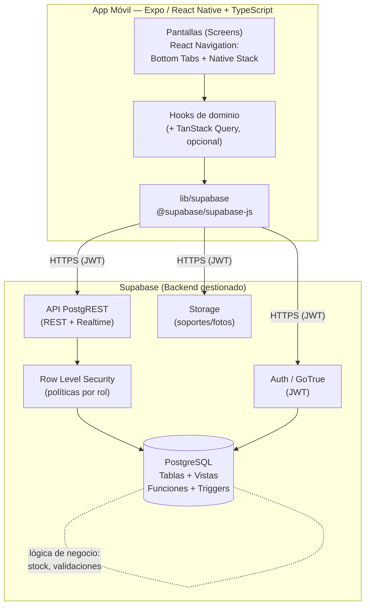
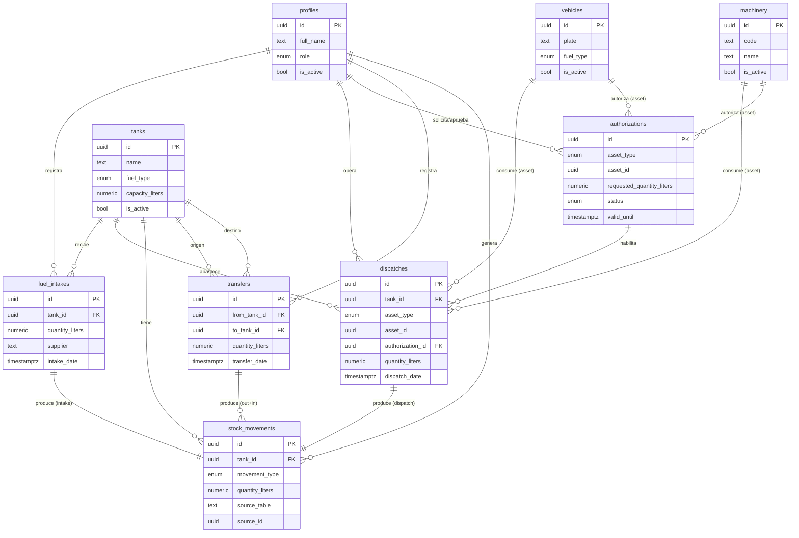
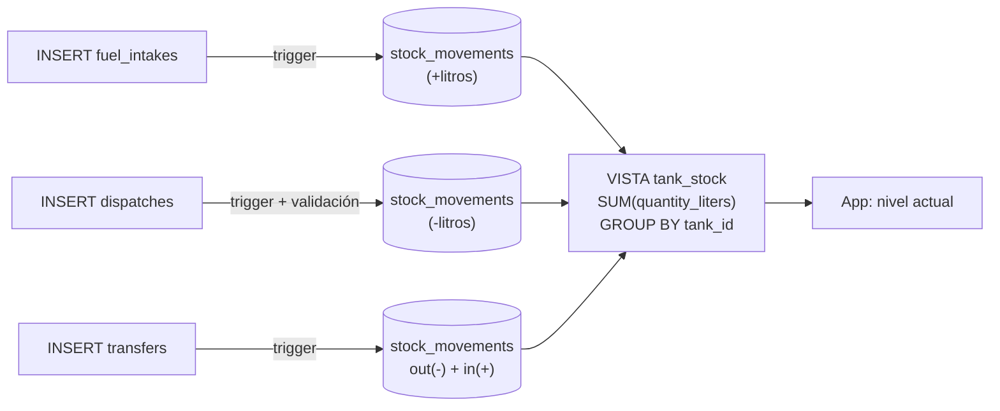
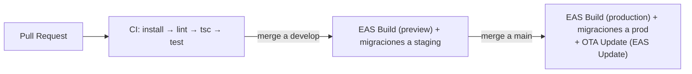
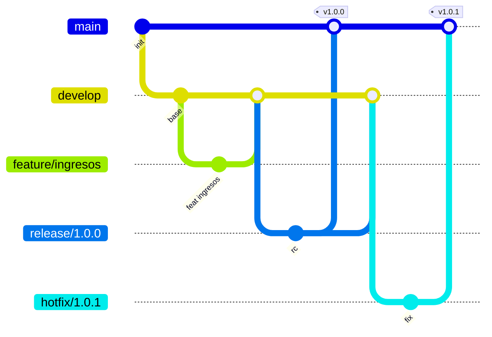

# Plan de Arquitectura — Control de Combustible

> Documento de arquitectura de software para la aplicación **Control de Combustible**.
> Aplicación móvil de gestión de inventario y movimientos de combustible para flotas de vehículos y maquinaria.
> Versión: 1.0 — Fecha: 2026-06-29

---

## Índice

1. [Resumen de la arquitectura](#1-resumen-de-la-arquitectura)
2. [Justificación del stack](#2-justificación-del-stack)
3. [Modelo de datos](#3-modelo-de-datos)
4. [Estrategia de cálculo de stock de tanques](#4-estrategia-de-cálculo-de-stock-de-tanques)
5. [Seguridad: Auth, roles y RLS](#5-seguridad-auth-roles-y-rls)
6. [Estructura de carpetas del proyecto](#6-estructura-de-carpetas-del-proyecto)
7. [Sistema de diseño](#7-sistema-de-diseño)
8. [Estrategia de entornos y configuración](#8-estrategia-de-entornos-y-configuración)
9. [Pruebas y CI/CD](#9-pruebas-y-cicd)
10. [Convenciones GitFlow](#10-convenciones-gitflow)

---

## 1. Resumen de la arquitectura

La aplicación es un cliente móvil **Expo (React Native) + TypeScript** que se comunica directamente con un backend gestionado **Supabase** (sin servidor intermedio propio). Supabase provee la base de datos **PostgreSQL**, la autenticación (**GoTrue Auth**), la seguridad a nivel de fila (**Row Level Security**), el almacenamiento de archivos (**Storage**) y una API REST/Realtime autogenerada (**PostgREST**).

Las reglas de negocio críticas (sumar/restar stock, validar autorizaciones, impedir despachar más que el disponible) se aplican **en la base de datos** mediante funciones, triggers y políticas RLS, de modo que sean infranqueables aunque el cliente falle o sea manipulado.



**Principios rectores:**

- **Backend-as-a-Service:** sin backend a medida; menor superficie a mantener.
- **La verdad vive en la base de datos:** stock derivado de movimientos, no de un contador editable.
- **Seguridad por defecto:** RLS activo en todas las tablas; el cliente nunca confía en sí mismo para autorizar.
- **Offline-tolerante (futuro):** TanStack Query habilita caché y reintentos; arquitectura preparada para sincronización.

---

## 2. Justificación del stack

### 2.1 Expo (React Native) + TypeScript

| Criterio | Expo + RN | Alternativas | Decisión |
|---|---|---|---|
| Cobertura iOS + Android | Una sola base de código compila a ambas plataformas | Nativo (Swift/Kotlin) duplica esfuerzo; Flutter usa Dart (curva nueva) | **Expo** |
| Velocidad de desarrollo | OTA updates, Expo Go, EAS Build en la nube (sin Xcode/Android Studio local) | RN "bare" exige toolchain nativo completo | **Expo** |
| Ecosistema/tipos | TS de primera clase, tipos generados de Supabase | — | **TS** |
| Equipo | JS/TS reutilizable entre web y móvil | Flutter requiere reentrenar | **Expo** |

- **TypeScript** aporta seguridad de tipos extremo a extremo: se pueden **generar los tipos de la base de datos** de Supabase (`supabase gen types typescript`) y consumirlos en el cliente, evitando errores de campos/relaciones.
- **Cobertura iOS + Android** garantizada con una sola base de código; PWA/web posible a futuro con `react-native-web`.

### 2.2 Supabase vs alternativas

| Necesidad | Supabase | Firebase | Backend propio |
|---|---|---|---|
| Base de datos relacional | PostgreSQL (ideal para inventario/movimientos con integridad referencial y transacciones) | Firestore (NoSQL, mal encaje para sumas/saldos consistentes) | Flexible pero costoso de construir |
| Reglas de negocio en datos | Funciones, triggers, constraints, RLS | Reglas limitadas; lógica empujada al cliente/Functions | Total control, más código |
| Auth + roles | Incluido (GoTrue) + RLS por rol | Incluido | A construir |
| Costo/Tiempo | Gratis para empezar, autohospedable | Vendor lock-in mayor | Mayor |

**Conclusión:** el dominio (stock, saldos, despachos que no pueden exceder existencias) es intrínsecamente **transaccional y relacional**, por lo que **PostgreSQL + RLS de Supabase** es el encaje natural, superior a una base NoSQL.

### 2.3 Estado y datos

- **`@supabase/supabase-js`** como cliente único (Auth + datos + Storage).
- **TanStack Query (opcional, recomendado)** para caché, invalidación, estados de carga/error y reintentos. El estado de servidor se gestiona con Query; el estado de UI local con `useState`/`useReducer` o Context ligero.

---

## 3. Modelo de datos

> El SQL completo (DDL, índices, constraints, triggers, políticas) vive en **`supabase/schema.sql`**. Aquí se describe el modelo **conceptualmente**.

### 3.1 Tablas y campos

#### `profiles` — Perfil de usuario (1:1 con `auth.users`)
- `id` (PK, = `auth.users.id`)
- `full_name`
- `role` → enum: `admin`, `supervisor`, `operador`, `consulta`
- `phone`
- `is_active`
- `created_at`, `updated_at`

#### `tanks` — Tanques de almacenamiento
- `id` (PK)
- `name` / `code` (identificador legible)
- `fuel_type` → enum: `diesel`, `gasolina`, `otro`
- `capacity_liters` (capacidad máxima)
- `location` (ubicación/sede)
- `is_active`
- `created_at`, `updated_at`
- *Nivel actual:* **derivado** de `stock_movements` (no se almacena como campo mutable; ver §4).

#### `vehicles` — Vehículos
- `id` (PK)
- `plate` (placa, único)
- `description` / `model`
- `fuel_type`
- `tank_capacity_liters` (capacidad del tanque del vehículo, opcional)
- `is_active`
- `created_at`, `updated_at`

#### `machinery` — Maquinaria
- `id` (PK)
- `code` (identificador, único)
- `name` / `description`
- `fuel_type`
- `hour_meter` / `odometer` (horómetro u odómetro de referencia)
- `is_active`
- `created_at`, `updated_at`

> *Nota de diseño:* `vehicles` y `machinery` se modelan como tablas separadas por tener atributos distintos (placa vs horómetro). Los consumos referencian un **destino polimórfico** (`asset_type` + `asset_id`).

#### `fuel_intakes` — Ingresos (entradas de combustible)
- `id` (PK)
- `tank_id` (FK → `tanks`)
- `quantity_liters` (> 0)
- `supplier` (proveedor)
- `unit_cost` / `total_cost` (opcional)
- `document_ref` (n.º de factura/guía)
- `attachment_url` (soporte en Storage, opcional)
- `intake_date`
- `created_by` (FK → `profiles`)
- `created_at`
- **Regla:** un ingreso **suma** stock al tanque (genera un `stock_movement` de tipo `intake`).

#### `dispatches` — Consumos / Despachos
- `id` (PK)
- `tank_id` (FK → `tanks`, origen del combustible)
- `asset_type` → enum: `vehicle`, `machinery`
- `asset_id` (FK lógica → `vehicles` o `machinery` según `asset_type`)
- `authorization_id` (FK → `authorizations`, **obligatoria y aprobada**)
- `quantity_liters` (> 0)
- `odometer_reading` / `hour_meter_reading` (lectura al despachar, opcional)
- `dispatch_date`
- `operator_id` (FK → `profiles`)
- `notes`
- `created_at`
- **Reglas:** requiere `authorization_id` con estado `aprobada`; **no puede exceder el stock disponible** del tanque; **resta** stock (genera `stock_movement` de tipo `dispatch`).

#### `authorizations` — Autorizaciones
- `id` (PK)
- `asset_type`, `asset_id` (activo autorizado)
- `requested_quantity_liters` (cupo autorizado)
- `consumed_quantity_liters` (acumulado, opcional para control de cupo)
- `status` → enum: `pendiente`, `aprobada`, `rechazada`, `consumida`, `vencida`
- `valid_from`, `valid_until` (vigencia)
- `requested_by` (FK → `profiles`)
- `approved_by` (FK → `profiles`, nullable)
- `approved_at`
- `reason` / `notes`
- `created_at`, `updated_at`
- **Regla:** solo una autorización en estado `aprobada` y vigente habilita un `dispatch`.

#### `transfers` — Traslados entre tanques
- `id` (PK)
- `from_tank_id` (FK → `tanks`)
- `to_tank_id` (FK → `tanks`, distinto de origen)
- `quantity_liters` (> 0)
- `transfer_date`
- `created_by` (FK → `profiles`)
- `notes`
- `created_at`
- **Regla:** **resta** del tanque origen y **suma** al destino (genera **dos** `stock_movements`: `transfer_out` y `transfer_in`); no puede exceder el stock del origen.

#### `stock_movements` — Movimientos de stock (libro mayor / ledger)
> Tabla central, **append-only** (solo inserción). Es la **única fuente de verdad** del nivel de cada tanque.
- `id` (PK)
- `tank_id` (FK → `tanks`)
- `movement_type` → enum: `intake`, `dispatch`, `transfer_in`, `transfer_out`, `adjustment`
- `quantity_liters` (con **signo**: positivo entra, negativo sale)
- `source_table` + `source_id` (referencia al documento origen: `fuel_intakes`, `dispatches`, `transfers`)
- `balance_after` (saldo del tanque tras el movimiento, opcional para auditoría)
- `created_by` (FK → `profiles`)
- `created_at`
- **Regla:** generada por triggers desde `fuel_intakes`, `dispatches`, `transfers`; nunca editada manualmente (salvo `adjustment` por admin).

### 3.2 Diagrama ER



---

## 4. Estrategia de cálculo de stock de tanques

El nivel de un tanque **nunca** se almacena como un campo mutable editable. Se **deriva** de la suma de los `stock_movements` de ese tanque. Esto garantiza consistencia, auditabilidad y trazabilidad (cada litro tiene un documento origen).

### 4.1 Patrón general (Ledger + Trigger + Vista)

1. **Ledger append-only:** cada operación de negocio inserta filas en `stock_movements` con cantidad **con signo**.
2. **Triggers de negocio:** funciones `AFTER INSERT` sobre `fuel_intakes`, `dispatches` y `transfers` crean automáticamente los movimientos correspondientes:
   - Ingreso → `+quantity` (`intake`)
   - Despacho → `-quantity` (`dispatch`)
   - Traslado → `-quantity` en origen (`transfer_out`) y `+quantity` en destino (`transfer_in`)
3. **Vista derivada `tank_stock`:** agrega el saldo actual por tanque.



**Vista conceptual `tank_stock`:**
- `tank_id`
- `current_liters` = `SUM(quantity_liters)` agrupado por `tank_id`
- `capacity_liters` (de `tanks`)
- `fill_percentage` = `current_liters / capacity_liters`

### 4.2 Validaciones críticas en la base de datos

- **No despachar más que el disponible:** la función de validación del despacho/traslado bloquea (lanza excepción) si `quantity_liters > tank_stock.current_liters`. Se ejecuta dentro de una **transacción** con bloqueo de fila (`SELECT ... FOR UPDATE` sobre el tanque) para evitar condiciones de carrera entre despachos concurrentes.
- **Consumo requiere autorización aprobada:** la función verifica que `authorization_id` exista, esté en estado `aprobada`, vigente (`valid_until >= now()`) y corresponda al mismo activo (`asset_type`/`asset_id`).
- **Cantidades positivas:** `CHECK (quantity_liters > 0)` en las tablas de operación.
- **No exceder capacidad (opcional):** un ingreso/traslado puede validar que el resultado no supere `capacity_liters`.

> Razonamiento: colocar estas reglas en la base de datos (no solo en el cliente) las hace **infranqueables**, incluso ante errores de la app, llamadas directas a la API o concurrencia.

---

## 5. Seguridad: Auth, roles y RLS

### 5.1 Autenticación

- **Supabase Auth (GoTrue)** con email/contraseña (ampliable a OTP/magic link).
- El cliente guarda la sesión (JWT) de forma persistente y segura en el dispositivo (`expo-secure-store` como `storage` del cliente de Supabase).
- Cada petición a PostgREST/Storage viaja con el **JWT**; PostgreSQL conoce `auth.uid()` y el rol del usuario.

### 5.2 Roles

| Rol | Descripción |
|---|---|
| `admin` | Control total: usuarios, tanques, vehículos, maquinaria, ajustes de stock, todo lectura/escritura. |
| `supervisor` | Aprueba/rechaza autorizaciones; ve reportes; registra ingresos y traslados. |
| `operador` | Registra despachos/consumos e ingresos; lectura de catálogos; no aprueba autorizaciones. |
| `consulta` | Solo lectura (dashboard y reportes). |

El rol se almacena en `profiles.role` y se lee en las políticas mediante una función auxiliar `current_user_role()` (o claim en el JWT).

### 5.3 Políticas RLS por tabla (resumen por rol)

> **RLS activado en TODAS las tablas.** Resumen: L = SELECT, C = INSERT, U = UPDATE, D = DELETE.

| Tabla | admin | supervisor | operador | consulta |
|---|---|---|---|---|
| `profiles` | L C U D | L (todos), U (propio) | L (propio), U (propio) | L (propio) |
| `tanks` | L C U D | L | L | L |
| `vehicles` | L C U D | L C U | L | L |
| `machinery` | L C U D | L C U | L | L |
| `fuel_intakes` | L C U D | L C | L C | L |
| `dispatches` | L C U D | L C | L C (con autorización aprobada) | L |
| `authorizations` | L C U D | L C U (aprobar/rechazar) | L C (solicitar) | L |
| `transfers` | L C U D | L C | L C | L |
| `stock_movements` | L (C solo `adjustment`) | L | L | L |

**Notas de implementación:**
- `stock_movements` es **solo lectura** para todos salvo ajustes de `admin`; las inserciones normales las hace el trigger con privilegios (`SECURITY DEFINER`).
- Las políticas de `INSERT` en `dispatches` se refuerzan con la validación de autorización y stock en el trigger (defensa en profundidad).
- **Storage:** bucket de soportes con políticas que permiten subir a `operador`/`supervisor`/`admin` y lectura según rol.

---

## 6. Estructura de carpetas del proyecto

```text
Control-de-Combustible/
├── app.json                  # Configuración Expo
├── App.tsx                   # Punto de entrada (providers + navegación)
├── index.ts
├── package.json
├── tsconfig.json
├── .env                      # Variables locales (NO versionar)
├── .env.example              # Plantilla de variables
├── docs/
│   └── PLAN.md               # Este documento
├── supabase/
│   ├── schema.sql            # DDL completo: tablas, triggers, RLS
│   ├── seed.sql              # Datos de ejemplo (opcional)
│   └── migrations/           # Migraciones versionadas
├── assets/                   # Imágenes, íconos, fuentes
└── src/
    ├── navigation/
    │   ├── RootNavigator.tsx        # Stack raíz (auth vs app)
    │   ├── AuthNavigator.tsx        # Login / registro
    │   ├── AppTabs.tsx              # Bottom Tabs principales
    │   └── types.ts                 # Tipados de rutas/params
    ├── screens/
    │   ├── auth/                    # Login, recuperar contraseña
    │   ├── dashboard/               # Dashboard y reportes
    │   ├── intakes/                 # Ingresos (lista, detalle, alta)
    │   ├── dispatches/              # Consumos/Despachos
    │   ├── tanks/                   # Tanques (nivel, detalle)
    │   ├── authorizations/          # Autorizaciones (solicitar/aprobar)
    │   ├── assets/                  # Vehículos y maquinaria
    │   ├── transfers/               # Traslados
    │   └── settings/                # Usuarios, perfil, roles
    ├── components/
    │   ├── ui/                      # Botón, Card, Input, Badge, etc.
    │   ├── forms/                   # Campos y formularios reutilizables
    │   └── feedback/                # Loaders, EmptyState, ErrorState
    ├── lib/
    │   ├── supabase.ts              # Cliente @supabase/supabase-js
    │   └── queryClient.ts           # TanStack Query (opcional)
    ├── hooks/
    │   ├── useAuth.ts               # Sesión y rol del usuario
    │   ├── useTanks.ts              # Tanques + stock
    │   ├── useDispatches.ts
    │   ├── useIntakes.ts
    │   ├── useAuthorizations.ts
    │   └── useTransfers.ts
    ├── services/                    # Capa de acceso a datos (queries Supabase)
    │   ├── tanks.service.ts
    │   ├── dispatches.service.ts
    │   └── ...
    ├── types/
    │   ├── database.types.ts        # Tipos generados de Supabase
    │   └── domain.ts                # Tipos de dominio/UI
    ├── theme/
    │   ├── colors.ts                # Paleta de tonos neutros
    │   ├── typography.ts
    │   └── spacing.ts
    ├── context/
    │   └── AuthContext.tsx
    └── utils/
        ├── format.ts                # Formato litros, fechas, moneda
        └── validation.ts
```

---

## 7. Sistema de diseño

Estética **profesional y sobria** basada en **tonos neutros** (grises cálidos/fríos suaves), con acentos funcionales reservados para estados (éxito/advertencia/peligro). Pensada para lectura clara en exteriores/campo.

### 7.1 Paleta (modo claro)

| Token | Hex | Uso |
|---|---|---|
| `background` | `#F5F5F4` | Fondo general de pantallas |
| `surface` | `#FFFFFF` | Tarjetas, hojas, inputs |
| `surfaceAlt` | `#EAEAE8` | Superficies secundarias, separadores |
| `border` | `#D6D5D2` | Bordes y divisores |
| `primary` | `#3F3F46` | Acción principal (gris pizarra) |
| `primaryContrast` | `#FFFFFF` | Texto sobre primary |
| `text` | `#1C1C1E` | Texto principal |
| `muted` | `#6B7280` | Texto secundario / placeholders |
| `success` | `#15803D` | Confirmaciones, stock OK |
| `warning` | `#B45309` | Stock bajo, vigencia próxima |
| `danger` | `#B91C1C` | Errores, exceder stock, rechazos |

### 7.2 Paleta (modo oscuro — opcional)

| Token | Hex |
|---|---|
| `background` | `#18181B` |
| `surface` | `#27272A` |
| `border` | `#3F3F46` |
| `primary` | `#E4E4E7` |
| `text` | `#FAFAFA` |
| `muted` | `#A1A1AA` |
| `success` | `#22C55E` |
| `warning` | `#F59E0B` |
| `danger` | `#EF4444` |

### 7.3 Tipografía

- **Familia:** fuente del sistema (`System` / SF Pro en iOS, Roboto en Android) o `Inter` vía `expo-font`.
- **Escala:**
  - `display` 28 / bold — títulos de dashboard
  - `h1` 22 / semibold — encabezados de pantalla
  - `h2` 18 / semibold — secciones
  - `body` 16 / regular — texto principal
  - `caption` 13 / regular — etiquetas, metadatos
  - `mono`/numérico tabular para litros y saldos
- **Espaciado base (4px):** 4, 8, 12, 16, 24, 32; radio de borde 8–12; sombras suaves.

### 7.4 Componentes base

`Button` (primario/secundario/peligro), `Card`, `Input` / `Select`, `Badge` (estados de autorización), `StockGauge` (barra de nivel de tanque con color por umbral), `ListItem`, `EmptyState`, `ErrorState`, `Loader`, `AmountInput` (litros), `DatePicker`.

---

## 8. Estrategia de entornos y configuración

### 8.1 Variables de entorno

En Expo, las variables expuestas al cliente **deben** llevar el prefijo `EXPO_PUBLIC_`. Las claves sensibles (service_role) **nunca** van en el cliente.

**`.env.example`**
```bash
# URL del proyecto Supabase
EXPO_PUBLIC_SUPABASE_URL=https://xxxxxxxx.supabase.co
# Clave anónima (pública, segura para el cliente; protegida por RLS)
EXPO_PUBLIC_SUPABASE_ANON_KEY=eyJhbGciOi...
# Entorno lógico
EXPO_PUBLIC_ENV=development
```

- `EXPO_PUBLIC_SUPABASE_ANON_KEY` es **pública por diseño**: la seguridad real la impone **RLS**, no el ocultamiento de la clave.
- La **`service_role` key NO se incluye** en la app; solo se usa en el servidor/migraciones/CI con secretos protegidos.
- `.env` está en `.gitignore`; se versiona únicamente `.env.example`.

### 8.2 Entornos

| Entorno | Proyecto Supabase | Build EAS |
|---|---|---|
| `development` | Proyecto dev | `eas build --profile development` |
| `staging` | Proyecto staging | `--profile preview` |
| `production` | Proyecto prod | `--profile production` |

Configuración de perfiles en `eas.json`; cada perfil inyecta sus variables `EXPO_PUBLIC_*`. La configuración dinámica puede moverse a `app.config.ts` si se requiere lógica por entorno.

---

## 9. Pruebas y CI/CD

### 9.1 Pruebas

- **Unitarias:** Jest + `jest-expo` (utils de formato/validación, lógica de hooks).
- **Componentes:** React Native Testing Library (render y estados de UI).
- **Calidad de datos:** pruebas SQL de los triggers/validaciones (stock no negativo, autorización requerida) ejecutadas contra una instancia Supabase local (`supabase start`).
- **Tipado:** `tsc --noEmit` y tipos generados de la base de datos como contrato.
- **Lint/Format:** ESLint + Prettier.

### 9.2 CI/CD (GitHub Actions)



- **CI en cada PR:** instalar, lint, `tsc --noEmit`, pruebas.
- **CD:** builds con **EAS Build**; actualizaciones OTA con **EAS Update**; migraciones de base de datos con **Supabase CLI** aplicadas por entorno usando secretos del repositorio.

---

## 10. Convenciones GitFlow

### 10.1 Ramas



| Rama | Origen | Destino | Propósito |
|---|---|---|---|
| `main` | — | — | Producción estable; cada merge etiquetado (`vX.Y.Z`). |
| `develop` | `main` | — | Integración de features. |
| `feature/*` | `develop` | `develop` | Nueva funcionalidad. |
| `release/*` | `develop` | `main` + `develop` | Estabilización previa a publicar. |
| `hotfix/*` | `main` | `main` + `develop` | Corrección urgente en producción. |

### 10.2 Nomenclatura de ramas

```text
feature/<modulo>-<descripcion-corta>   # feature/dispatches-validacion-stock
fix/<descripcion>                      # fix/calculo-nivel-tanque
hotfix/<version>-<descripcion>         # hotfix/1.0.1-login
release/<version>                      # release/1.1.0
```

### 10.3 Commits (Conventional Commits)

```text
<tipo>(<alcance>): <descripción en imperativo>

tipos: feat | fix | docs | style | refactor | test | chore | ci
ejemplos:
  feat(dispatches): validar stock disponible antes de despachar
  fix(tanks): corregir cálculo de nivel derivado de movimientos
  docs(plan): añadir modelo de datos y diagrama ER
  chore(ci): configurar EAS Build para staging
```

### 10.4 Versionado

- **SemVer** (`MAYOR.MENOR.PARCHE`).
- Pull Requests obligatorios hacia `develop`/`main` con revisión y CI en verde antes de fusionar.

---

*Fin del documento.*
